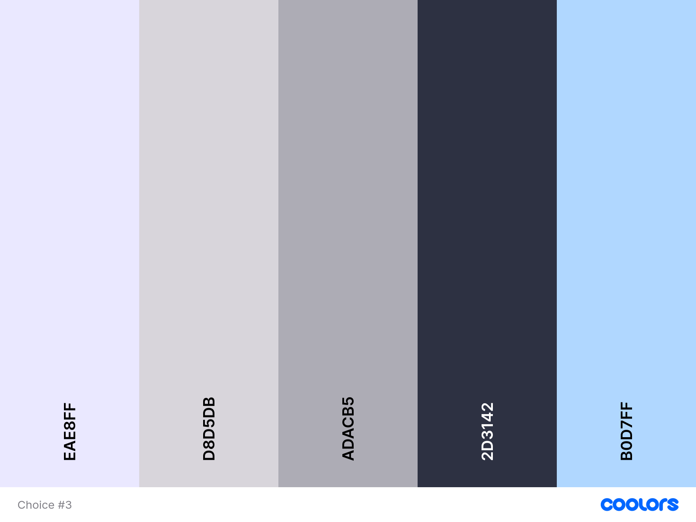

    
  
# **Globetalk**

#### Globetalk is a chat app for tourists that you can use to talk with local businesses and tourists to find cool spots! Whether you're looking for a good place to eat, or just a fun time, chat with other tourists to find your new favorite spot in the city

|                                 COLOR PALETTE                                 |                                             DEMO                                              |
| :---------------------------------------------------------------------------: | :-------------------------------------------------------------------------------------------: |
|  | <video width=100% controls><source src="read-me/demo.mp4" type="video/mp4">DEMO Video</video> |

## **KEY FEATURES:**

- Different servers for major countries
- Different channels inside of servers for major cities
- Applying for a role as a local business

## **HOW TO USE (Visual Studio Code)**

1. Clone this repository with `git clone https://github.com/Fake4091/Travel-Chat-App/`

2. Prepare your environment by entering the folder with `cd Travel-Chat-App`, then `python manage.py makemigrations && python manage.py migrate` on Windows or `python3 manage.py makemigrations && python3 manage.py migrate` on MacOS

3. Run the server with `python manage.py runserver` on Windows or `python3 manage.py runserver` on MacOS

4. go to <http://localhost:8000> in your browser
